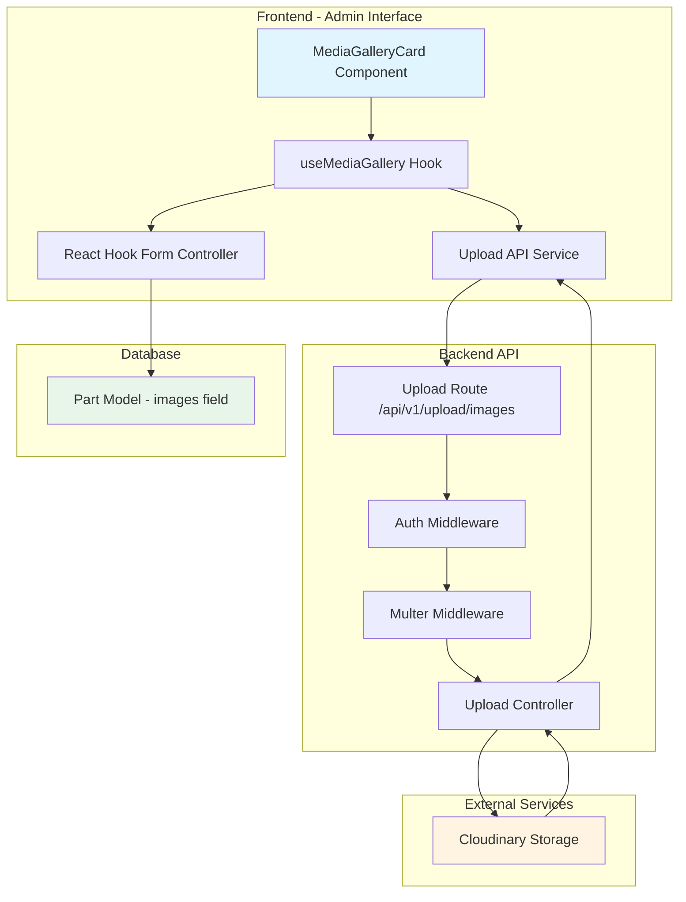

# Design Document: Parts Management Enhancement

## Overview

This design document specifies the technical implementation for integrating Cloudinary image upload functionality into the parts management system. The enhancement brings feature parity with existing product and car modules by enabling admin users to upload, manage, and display part images through the MediaGalleryCard component.

The implementation leverages existing infrastructure:
- **Backend**: Existing Cloudinary configuration and upload controller endpoints
- **Frontend**: Existing upload API service and React Hook Form integration
- **Storage**: Cloudinary cloud storage with existing folder structure (`carshop/uploads`)

This is primarily an **integration and UI enhancement** task that connects existing components rather than introducing new business logic or algorithms.

## Architecture

### System Components



### Data Flow

#### Upload Flow
1. Admin selects images in MediaGalleryCard component
2. useMediaGallery hook creates FormData with selected files
3. Upload API service sends POST request to `/api/v1/upload/images`
4. Auth middleware validates user authentication
5. Multer middleware processes multipart form data
6. Upload controller extracts files and uploads to Cloudinary
7. Cloudinary returns secure URLs
8. Controller responds with array of URLs
9. useMediaGallery hook updates form field value
10. React Hook Form syncs with form state
11. On form submit, Part model saves URLs to `images` array

#### Display Flow (Client)
1. Customer navigates to part detail page
2. Frontend fetches part data including `images` array
3. Component renders images from Cloudinary URLs
4. First image displayed as primary, others in gallery

#### Management Flow (Admin)
1. Admin drags image to reorder → useMediaGallery updates array order
2. Admin clicks remove → useMediaGallery removes URL from array
3. Changes reflected immediately in form state
4. On save, updated array persisted to database

## Components and Interfaces

### Frontend Components

#### MediaGalleryCard Component
**Location**: `frontend/src/pages/Admin/PartForm/components/MediaGalleryCard/index.jsx`

**Props**:
```typescript
interface MediaGalleryCardProps {
  control: Control<PartFormData>;  // React Hook Form control object
  name: string;                     // Form field name (e.g., "images")
  t: TFunction;                     // i18n translation function
}
```

**Responsibilities**:
- Render drag-and-drop upload interface using Ant Design Dragger
- Display uploaded images in responsive grid with drag-to-reorder
- Show loading spinner during upload
- Delegate business logic to useMediaGallery hook

**UI Features**:
- Drag-and-drop file upload zone
- Multiple file selection support
- Loading indicator during upload
- Image preview grid (2 columns mobile, 4 columns desktop)
- Drag-to-reorder functionality using @dnd-kit
- Remove button on each image

#### useMediaGallery Hook
**Location**: `frontend/src/pages/Admin/PartForm/components/MediaGalleryCard/hooks/useMediaGallery.js`

**Interface**:
```typescript
interface UseMediaGalleryReturn {
  images: string[];                           // Current image URLs
  sensors: SensorDescriptor<any>[];          // DnD sensors for drag detection
  handleUpload: (info: UploadChangeParam) => Promise<void>;
  handleRemove: (index: number) => void;
  handleDragEnd: (event: DragEndEvent) => void;
  isUploading: boolean;                      // Upload in progress flag
}
```

**Responsibilities**:
- Manage form field value using `useController` from React Hook Form
- Handle file upload by calling upload API service
- Update form state with new Cloudinary URLs
- Handle image reordering via drag-and-drop
- Handle image removal
- Display success/error messages using Ant Design message component

**State Management**:
- `images`: Derived from React Hook Form field value
- `isUploading`: Local state for upload progress indicator

#### SortableImageItem Component
**Location**: `frontend/src/pages/Admin/PartForm/components/MediaGalleryCard/SortableImageItem.jsx`

**Props**:
```typescript
interface SortableImageItemProps {
  id: string;           // Image URL (used as unique identifier)
  imgUrl: string;       // Cloudinary URL for display
  index: number;        // Position in array
  onRemove: (index: number) => void;
  t: TFunction;
}
```

**Responsibilities**:
- Render individual image with drag handle
- Provide remove button
- Integrate with @dnd-kit/sortable for drag-and-drop

### Backend Components

#### Upload Controller
**Location**: `backend/controllers/common/upload.controller.js`

**Endpoint**: `POST /api/v1/upload/images`

**Function Signature**:
```javascript
export const uploadImages = asyncHandler(async (req, res) => {
  // Implementation
});
```

**Request**:
- **Method**: POST
- **Content-Type**: multipart/form-data
- **Field Name**: `images` (array)
- **Max Files**: 10
- **Authentication**: Required (JWT token)

**Response**:
```javascript
{
  success: true,
  data: [
    "https://res.cloudinary.com/xxx/image/upload/v123/carshop/uploads/images-456.jpg",
    "https://res.cloudinary.com/xxx/image/upload/v123/carshop/uploads/images-789.jpg"
  ],
  message: "Tải ảnh lên thành công"
}
```

**Error Response**:
```javascript
{
  success: false,
  message: "Vui lòng chọn ít nhất 1 ảnh để tải lên"
}
```

**Responsibilities**:
- Validate that files are present in request
- Extract Cloudinary URLs from multer-processed files
- Return array of secure URLs
- Handle errors with descriptive messages

#### Upload Route
**Location**: `backend/routes/common/upload.route.js`

**Configuration**:
```javascript
router.post('/images', upload.array('images', 10), uploadImages);
```

**Middleware Chain**:
1. `protect` - Authentication middleware (validates JWT)
2. `upload.array('images', 10)` - Multer middleware (processes files, uploads to Cloudinary)
3. `uploadImages` - Controller function (returns URLs)

#### Cloudinary Configuration
**Location**: `backend/config/cloudinary.js`

**Settings**:
- **Folder**: `carshop/uploads`
- **Allowed Formats**: jpg, png, jpeg, webp
- **File Size Limit**: 10MB per file
- **Naming**: `{fieldname}-{timestamp}-{random}.{ext}`

**Multer Storage**:
```javascript
const storage = new CloudinaryStorage({
  cloudinary: cloudinary,
  params: {
    folder: 'carshop/uploads',
    allowed_formats: ['jpg', 'png', 'jpeg', 'webp'],
    public_id: (req, file) => {
      const uniqueSuffix = Date.now() + '-' + Math.round(Math.random() * 1e9)
      return file.fieldname + '-' + uniqueSuffix
    }
  }
})
```

### Frontend Services

#### Upload API Service
**Location**: `frontend/src/services/api/upload.api.js`

**Function**:
```javascript
export const uploadImages = async (files) => {
  const formData = new FormData();
  files.forEach(file => {
    formData.append('images', file);
  });

  const response = await axiosClient.post('/upload/images', formData, {
    headers: {
      'Content-Type': 'multipart/form-data',
    },
  });

  return response.data.data;
};
```

**Responsibilities**:
- Create FormData object with file array
- Send POST request to backend upload endpoint
- Include authentication headers (handled by axiosClient interceptor)
- Return array of Cloudinary URLs
- Propagate errors to caller

## Data Models

### Part Model
**Location**: `backend/models/partModel.js`

**Relevant Fields**:
```javascript
{
  images: {
    type: [String],
    default: [],
  }
}
```

**Virtual Fields**:
```javascript
// Primary image (first in array)
partSchema.virtual('image').get(function () {
  return this.images && this.images.length > 0 ? this.images[0] : null;
});
```

**Data Constraints**:
- `images` is an array of strings (Cloudinary URLs)
- Empty array by default
- No maximum length constraint
- URLs are not validated at schema level (validation happens at upload)

**Example Data**:
```javascript
{
  _id: "507f1f77bcf86cd799439011",
  name: "Brake Pad Set",
  sku: "BP-001",
  images: [
    "https://res.cloudinary.com/xxx/image/upload/v123/carshop/uploads/images-456.jpg",
    "https://res.cloudinary.com/xxx/image/upload/v123/carshop/uploads/images-789.jpg",
    "https://res.cloudinary.com/xxx/image/upload/v123/carshop/uploads/images-012.jpg"
  ],
  // ... other fields
}
```

### Form Data Structure
**Frontend Form State**:
```typescript
interface PartFormData {
  name: string;
  sku: string;
  category: string;
  price: number;
  images: string[];  // Array of Cloudinary URLs
  // ... other fields
}
```

**React Hook Form Integration**:
- Field name: `"images"`
- Controller: `useController({ control, name: "images" })`
- Default value: `[]`
- Validation: None at form level (handled by backend)

## Error Handling

### Frontend Error Scenarios

#### Upload Errors

**Network Error**:
```javascript
try {
  const uploadedUrls = await uploadImages(files);
} catch (error) {
  message.error(error.message || t('adminPartForm:uploadError'));
}
```

**File Size Exceeded**:
- Handled by multer middleware
- Returns 400 status with error message
- Frontend displays error via Ant Design message

**Invalid File Type**:
- Handled by Cloudinary storage configuration
- Returns 400 status with error message
- Frontend displays error via Ant Design message

**Authentication Error**:
- Handled by protect middleware
- Returns 401 status
- axiosClient interceptor redirects to login

#### Form Validation Errors

**Empty Images Array**:
- Allowed (images are optional)
- No validation error

**Invalid URL Format**:
- Not validated at frontend
- Backend should validate if needed

### Backend Error Scenarios

#### Upload Controller Errors

**No Files Provided**:
```javascript
if (!req.files || req.files.length === 0) {
  res.status(400);
  throw new Error('Vui lòng chọn ít nhất 1 ảnh để tải lên');
}
```

**Cloudinary Upload Failure**:
- Handled by multer-storage-cloudinary
- Throws error automatically
- Caught by asyncHandler
- Returns 500 status with error message

#### Middleware Errors

**Authentication Failure** (protect middleware):
- Returns 401 status
- Message: "Not authorized, token failed"

**File Size Limit** (multer):
- Returns 400 status
- Message: "File too large"

**Invalid File Type** (Cloudinary storage):
- Returns 400 status
- Message: "Invalid file type"

### Error Messages

**Vietnamese Messages** (for user display):
- Upload success: "Tải ảnh lên thành công"
- Upload error: "Lỗi tải ảnh lên"
- No files: "Vui lòng chọn ít nhất 1 ảnh để tải lên"
- File too large: "Kích thước file quá lớn (tối đa 10MB)"
- Invalid type: "Định dạng file không hợp lệ (chỉ chấp nhận jpg, png, jpeg, webp)"

**English Messages** (for development/logging):
- "Upload error: {error details}"
- "Missing Cloudinary environment variables"
- "File size limit exceeded"

## Testing Strategy

This feature involves **integration of existing components** and **UI interactions** rather than pure business logic. Therefore, the testing strategy focuses on:

### Unit Tests

**Frontend Unit Tests**:
1. **useMediaGallery Hook Tests**:
   - Test that `handleUpload` calls `uploadImages` API with correct files
   - Test that successful upload updates form field value
   - Test that upload error displays error message
   - Test that `handleRemove` removes correct image from array
   - Test that `handleDragEnd` reorders images correctly
   - Test that `isUploading` state toggles during upload

2. **MediaGalleryCard Component Tests**:
   - Test that component renders upload zone
   - Test that component renders image grid when images exist
   - Test that loading spinner shows when `isUploading` is true
   - Test that drag-and-drop is disabled during upload

**Backend Unit Tests**:
1. **Upload Controller Tests**:
   - Test that controller returns 400 when no files provided
   - Test that controller returns array of URLs when files uploaded
   - Test that controller extracts URLs from `req.files[].path`

### Integration Tests

**Frontend Integration Tests**:
1. **Form Integration**:
   - Test that MediaGalleryCard syncs with React Hook Form
   - Test that form submission includes images array
   - Test that editing existing part loads images correctly

2. **API Integration**:
   - Test that upload API service sends correct FormData
   - Test that upload API service handles authentication
   - Test that upload API service returns Cloudinary URLs

**Backend Integration Tests**:
1. **Upload Endpoint**:
   - Test POST `/api/v1/upload/images` with valid files returns URLs
   - Test POST `/api/v1/upload/images` without auth returns 401
   - Test POST `/api/v1/upload/images` without files returns 400
   - Test POST `/api/v1/upload/images` with oversized file returns 400
   - Test POST `/api/v1/upload/images` with invalid file type returns 400

2. **Part CRUD with Images**:
   - Test creating part with images array saves correctly
   - Test updating part images array updates correctly
   - Test retrieving part returns images array
   - Test part virtual field `image` returns first image

### End-to-End Tests

**Admin Workflow**:
1. Admin logs in
2. Admin navigates to create part form
3. Admin uploads 3 images
4. Admin reorders images via drag-and-drop
5. Admin removes 1 image
6. Admin submits form
7. Verify part saved with 2 images in correct order

**Client Workflow**:
1. Customer navigates to part detail page
2. Verify primary image displays
3. Verify image gallery displays all images
4. Verify images load from Cloudinary

### Manual Testing Checklist

- [ ] Upload single image successfully
- [ ] Upload multiple images (up to 10) successfully
- [ ] Upload shows loading indicator
- [ ] Upload success shows success message
- [ ] Upload error shows error message
- [ ] Drag-and-drop reorders images
- [ ] Remove button deletes image
- [ ] Form submission includes images
- [ ] Edit existing part loads images
- [ ] Client page displays images
- [ ] Images load from Cloudinary
- [ ] File size limit enforced (10MB)
- [ ] File type validation enforced (jpg, png, jpeg, webp)
- [ ] Authentication required for upload

### Why Property-Based Testing is NOT Applicable

Property-based testing (PBT) is **not appropriate** for this feature because:

1. **Infrastructure Integration**: This feature integrates with external services (Cloudinary, file system) rather than implementing pure business logic
2. **UI Interactions**: The core functionality involves UI components (drag-and-drop, file upload) that are better tested with integration tests
3. **No Universal Properties**: There are no meaningful universal properties to test (e.g., "for all image arrays, property X holds")
4. **Side Effects**: Upload operations have side effects (files stored in Cloudinary) that cannot be easily tested with property-based approaches
5. **Configuration Validation**: The feature primarily validates configuration and wiring rather than algorithmic correctness

**Appropriate Testing Approach**:
- **Unit tests** for individual functions (upload handler, remove handler, reorder handler)
- **Integration tests** for API endpoints and form integration
- **End-to-end tests** for complete user workflows
- **Manual testing** for UI/UX validation

## Implementation Notes

### Consistency with Existing Modules

The implementation follows patterns established in product and car modules:

1. **Same Upload Endpoint**: Uses `/api/v1/upload/images` (shared across all modules)
2. **Same Cloudinary Config**: Uses same folder, file limits, and allowed formats
3. **Same Upload Service**: Uses `uploadImages` function from `upload.api.js`
4. **Same Component Pattern**: MediaGalleryCard structure matches product/car galleries
5. **Same Form Integration**: Uses React Hook Form `useController` pattern

### Key Implementation Details

**File Upload**:
- Ant Design Dragger component handles file selection
- `customRequest` prop prevents default upload behavior
- `onChange` handler triggers actual upload via API

**Drag-and-Drop**:
- @dnd-kit library provides drag-and-drop functionality
- `arrayMove` utility reorders array efficiently
- Sensors configured for both pointer and keyboard interaction

**Form Synchronization**:
- `useController` provides `field.value` and `field.onChange`
- All image operations update form state via `field.onChange`
- Form submission automatically includes current images array

**Loading State**:
- Local `isUploading` state prevents concurrent uploads
- Ant Design Spin component wraps upload zone
- Upload zone disabled during upload

**Error Handling**:
- Try-catch wraps upload operation
- Ant Design message component displays feedback
- Error messages support i18n translation

### Security Considerations

**Authentication**:
- All upload requests require valid JWT token
- `protect` middleware validates token before processing

**File Validation**:
- File size limited to 10MB per file
- Only image formats allowed (jpg, png, jpeg, webp)
- Cloudinary storage enforces format restrictions

**URL Storage**:
- Only Cloudinary URLs stored in database
- No local file paths or sensitive data
- URLs are public but obscured (random IDs)

**Input Sanitization**:
- Multer handles file parsing safely
- No user input in file naming (timestamp + random)
- Cloudinary handles image processing securely

### Performance Considerations

**Upload Performance**:
- Multiple files uploaded in single request (batch upload)
- Cloudinary handles image optimization automatically
- No frontend image processing (reduces client load)

**Display Performance**:
- Images served from Cloudinary CDN (fast delivery)
- Lazy loading can be added for image gallery
- Responsive images via Cloudinary transformations (optional)

**Form Performance**:
- Image URLs stored as strings (lightweight)
- No image data in form state (only URLs)
- Drag-and-drop uses efficient array operations

### Accessibility Considerations

**Keyboard Navigation**:
- Dragger component supports keyboard interaction
- Drag-and-drop supports keyboard via @dnd-kit sensors
- Remove buttons accessible via keyboard

**Screen Readers**:
- Upload zone has descriptive text
- Images should have alt attributes (future enhancement)
- Loading state announced via Spin component

**Visual Feedback**:
- Clear hover states on interactive elements
- Loading spinner indicates upload progress
- Success/error messages provide feedback

### Internationalization

**Translation Keys**:
- `adminPartForm:gallery` - "Thư viện ảnh"
- `adminPartForm:uploading` - "Đang tải ảnh..."
- `adminPartForm:dragDrop` - "Kéo thả ảnh vào đây"
- `adminPartForm:orClick` - "hoặc nhấp để chọn"
- `adminPartForm:uploadLimit` - "(Tối đa 10 ảnh)"
- `adminPartForm:dragToReorder` - "Kéo để sắp xếp lại"
- `adminPartForm:uploadSuccess` - "Tải ảnh lên thành công"
- `adminPartForm:uploadError` - "Lỗi tải ảnh lên"

**Language Support**:
- Vietnamese (primary)
- English (fallback)
- Translation function passed as prop to component

## Future Enhancements

### Potential Improvements

1. **Image Optimization**:
   - Add Cloudinary transformations for responsive images
   - Generate thumbnails for faster loading
   - Implement lazy loading for image gallery

2. **Advanced Upload Features**:
   - Drag-and-drop from desktop to upload zone
   - Paste images from clipboard
   - Upload progress bar for individual files
   - Concurrent upload with individual progress indicators

3. **Image Editing**:
   - Crop images before upload
   - Add filters or adjustments
   - Set focal point for responsive cropping

4. **Validation Enhancements**:
   - Validate image dimensions (min/max width/height)
   - Validate aspect ratio
   - Duplicate image detection

5. **User Experience**:
   - Preview images before upload
   - Bulk operations (remove all, reorder by date)
   - Image zoom on hover
   - Alt text input for accessibility

6. **Performance**:
   - Client-side image compression before upload
   - WebP format conversion
   - Progressive image loading

### Migration Path

If migrating from local storage to Cloudinary:
1. Upload existing images to Cloudinary
2. Update database with new Cloudinary URLs
3. Keep old URLs as fallback during transition
4. Remove old images after verification

## Conclusion

This design provides a comprehensive implementation plan for integrating Cloudinary image upload into the parts management system. The solution leverages existing infrastructure, follows established patterns, and ensures consistency across the application. The implementation focuses on user experience, error handling, and maintainability while keeping the codebase clean and testable.
